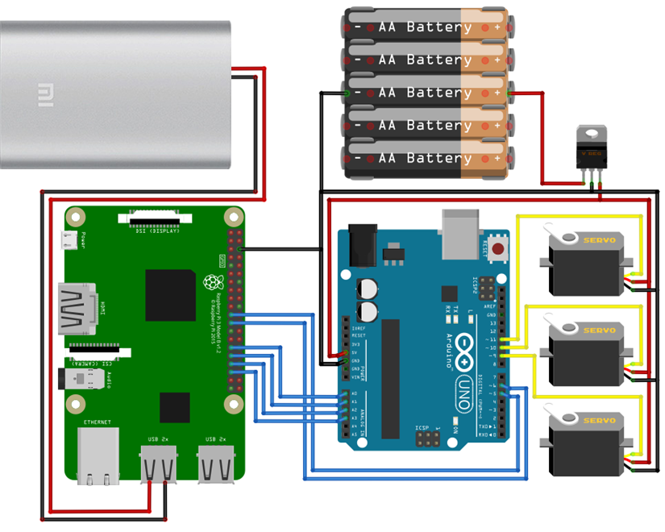
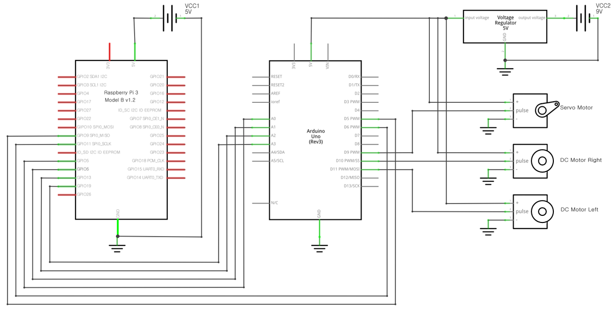
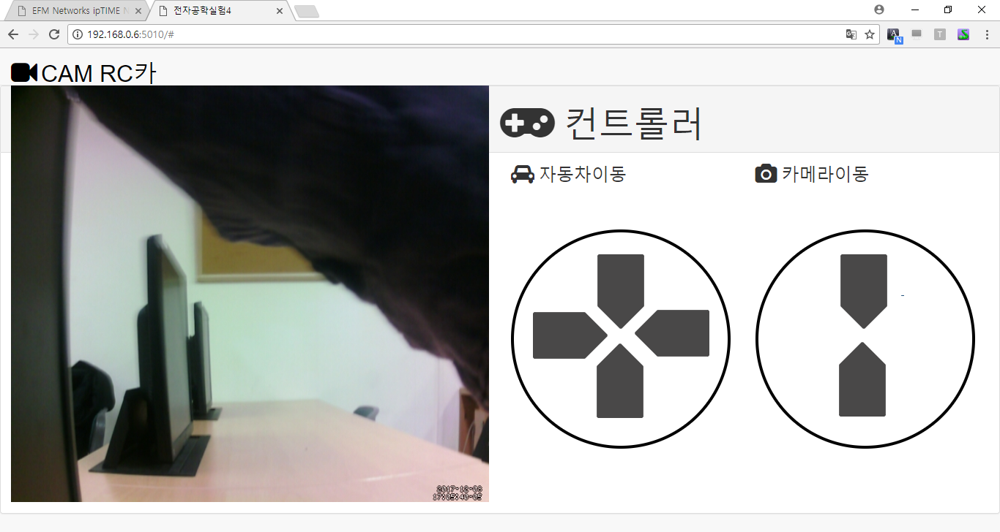

# 전자공학실험4 오후 13조(CAMRC카)

Web으로 조종하는 CAM RC카


### 시작하기에 앞서

필요한 것들

1) 라즈베리파이3
2) 아두이노 키트
3) 보조배터리

### 연결 방식


### 회로도



### 설치하기

1. motion
2. python-pip
3. flask

라즈베리파이 업데이트 & 업그레이드
```
$ sudo apt-get update & upgrade
```
카메라 라이브러리 설치
```
$ sudo apt-get install motion
```

파이썬 패키지매니저 설치
```
$ sudo apt-get install python-pip
```

플라스크 설치
```
$ sudo pip install flask
```
### motion 설정 변경
```
$ sudo vi /etc/default/motion
```

1) start_motion_daemon = yes 로설정

```
$ sudo vi /etc/motion/motion.conf
```

#### 필수설정
1) daemon = off 에서 on으로 설정 => 백그라운드에서 돌리기
2) webcam_localhost = on 에서 off 로 설정 => 외부에서 접속할수 있도록 설정

#### 카메라옵션
1) width 640 (추천)  => 자신이 원하는 크기로 너무크면 영상의 속도가 느려진다.
2) height 480 (추천)  => 자신이 원하는 크기로 너무크면 영상의 속도가 느려진다.
3) framerate 1000 (높은수치 설정) => frame설정을 30이상 올려도 비슷하다 그냥 1000으로 하였다.
4) webcam_port 8081 (기본)  =>webcam의 화면을 띄워줄 포트 번호

### html 수정

```
$ sudo vi /templates/index.html
```
자신의 라즈베리파이 ip로 수정을 하야한다.


## 테스트 실행하기

```
$ sudo python app.py
```

### End-to-End 테스트

```
라즈베리파이와 공유된 인터넷으로 http://라즈베리파이의ip:5010 으로 접속
```





---
